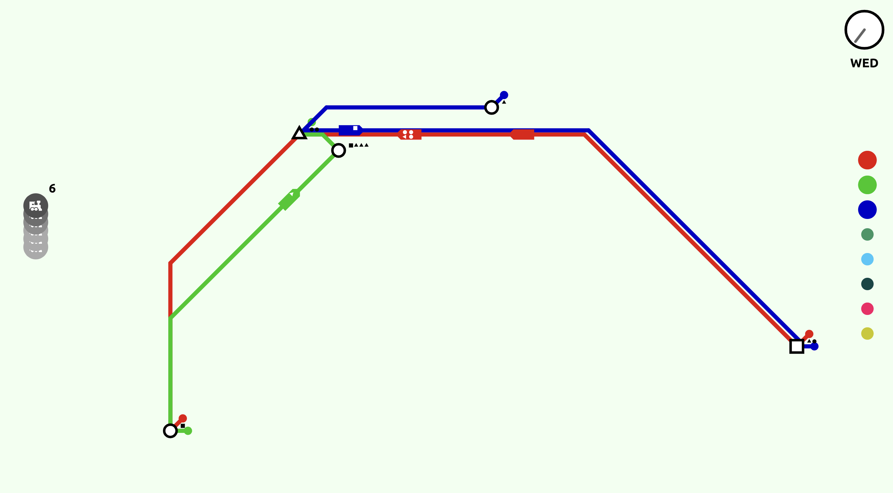

# **MINI METRO** 🚊
> **Name**: ChanwooKim   
> **ID**: 20200170   
> **Email**: kcwkcw0802@kaist.ac.kr   
> **URL**: http://git.prototyping.id/20200170/project1.git
***

## Game Description
- **Goal**   
This game is baisically brain game.   
Player should build efficient metro system with limited number of trains and lines.   
- **Rule**  
At the map, new stations are keep created. And for each station, new passengers are keep created.   
The station and passengers have their own types, and the types are one of circle, triangle, and sqaure.   
Passengers want to go to the station that matches  their type.   
Player should build appropriate metro lines and place trains to trasport passengers as mush as possible.
- **Interface**   
  
  * On the left side, there are gray circles with train icon. The number of circle means the number of new trains that user can use.
  * On the right side, there are several colored circles. The number of circle means the number of metro lines that user can use. Each of the circle represents the metro line. If the circle is large, it indicates that the metro line is currently being used. 
  * On ther upper right, there is a clock that showing the current time.
- **Action**   
  * Create a new line   
  Player can create a new line by press one staion, and drag it to other station.
  * Add a new staion to the line   
  If the player press the line and drag to other staions which are not in the line, those stations will be added to the line.
  * Remove a station from the line   
  If the player presses the line and drags to a station adjacent to the current position while being part of the line, that station is removed from the line.
  * Place a new train   
  Player can add a new train by press one of the circle with train icon and release it on the line.
  * Change a line of the train   
  Press a moving train and release it on the other line.
- **Game over**   
If more than seven passengers are piled up at one station for more than a day, it is a game over.
- **Score**  
A score is the number of passengers that player trasported until the game over.

## Code Organization
- **game.js**   
  + This is main file of the game. I draw the game and treat all events in this file.
  + Variable named 'currentPage' determines whether the game is started or before started or ended. Value of currentPage is controlled by 'keyTyped' event.
  + Object named 'game' contains all information of the current game.    
    ```javaScript
    game = {
      clock: new Clock(),
      score: new Score(),
      stationFactory: StationFactory.getInstance(),
      num_line: 8,
      num_train: 10,
      stations: [],
      lines: [],
      trains: [],
      lastStationTime: 0,
      trainButton: null,
    }
    ```
  + Function named 'processGame' is the main function of the game. In this function, I do things like below.
    * Draw all objects.
    * Create new stations and new passengers for each stations. These are created based on probability. Generating probability is proportional to (current time - last generation time).
    * Move trains.
    * Check game over.
    * Increase time.
  + For mouse events, I use variables named 'interact' and 'interactClass' for saving current interacting object and its class.   
  I handle mouse interaction by following below logic.
    1. By 'mousePressed' function, I identify what is the player clicked, and assign appropriate object, value to 'interact', 'interactClass'.
    2. In 'mouse dragged' function, event handling is performed for each class. If class is 'Train', I just set x, y coordinates of the train. If class is 'Connection' or 'Terminal'(These classes are components of 'Line' class.), I handle addition or deletion of a station from the line.
    3. In 'mouseReleased' function, event handling is performed for each class. If class is 'Train', I position the train on the line where the mouse is currently on it.
- **Station.js**
  + Staion.js contains 'Station' class, and 'StationFactory' class. 'StationFactory' is singleton class.
- **Line.js**
  + Line.js contains 'Line' class, 'Connection' class and 'Terminal' class. 'Connection' and 'Terminal' classes are the component of 'Line' class. 'Connection' class is used for line between one station and another staion. 'Terminal' class is used for the tail and head for a line. So, single line is composed with many connections and two terminals.
- **Train.js**
  + Train.js contains 'Train' class which is extended with 'Subject' class. All activated train object is subscribed by 'Score'. When passengers get off from the train, score is updated.


